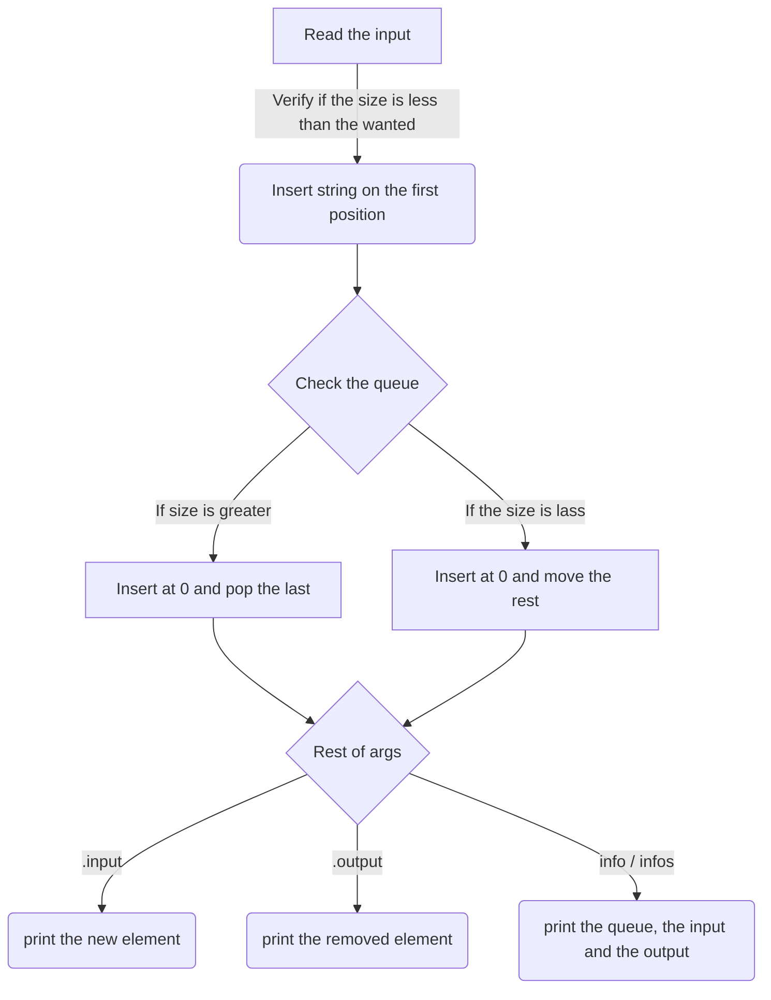

##### PyQueue
##### A simple module lib to queue your lists!

**_Usage:_**
-
```py
# List: The list you are going to transform into a queue
# Length: The maximum size of the queue
# Input: The input from the user (can be a input('')) or an str

Queue(list, length, input)
# Returns the simple queue

Queue(list, length, input).input()
# Returns the element that was added

Queue(list, length, input).output()
# Returns the element that was removed

Queue(list, length, input).infos() # or .info()
# Returns the queue, the input and the output of the queue.
```

**_How it works_**
-
- Insert the wanted string onto the list if the maximum size of the list is less than the wanted size.
- If the size of the list is greater than the wanted size, pop out the last queue element and insert the wanted string.





